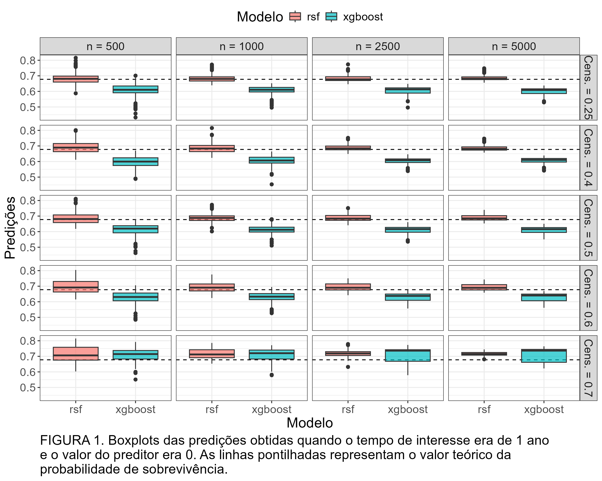
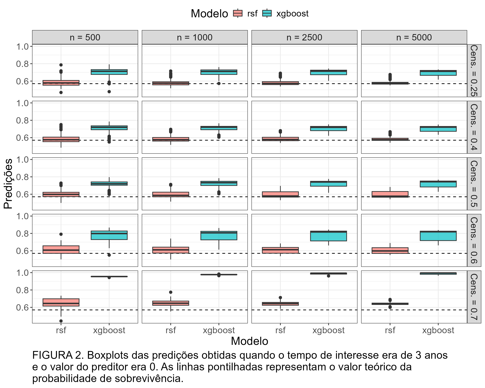
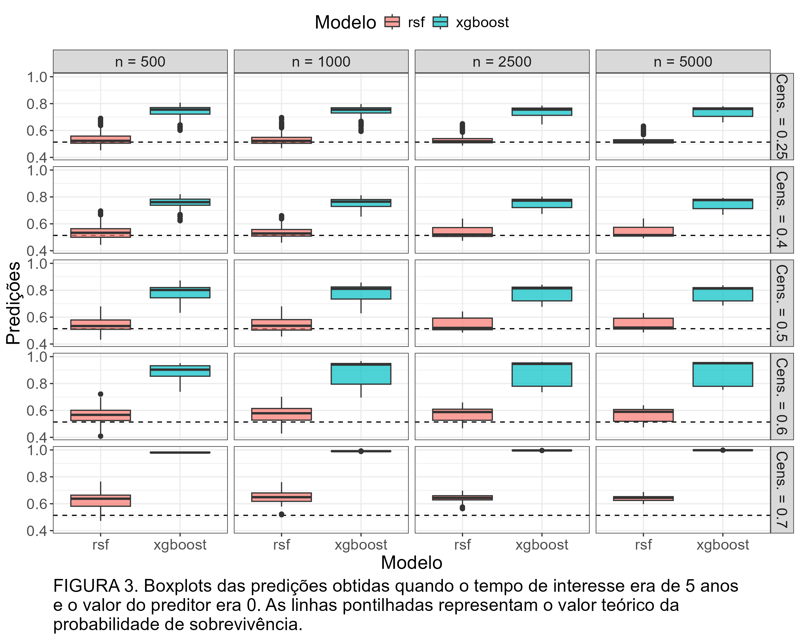
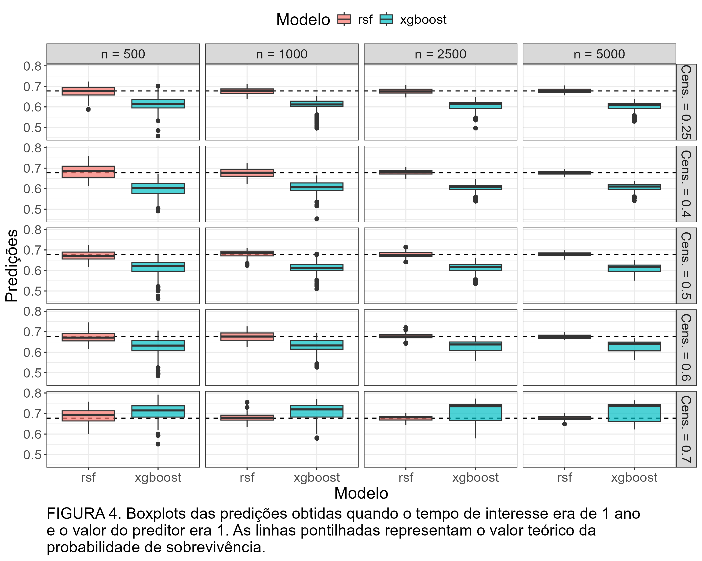
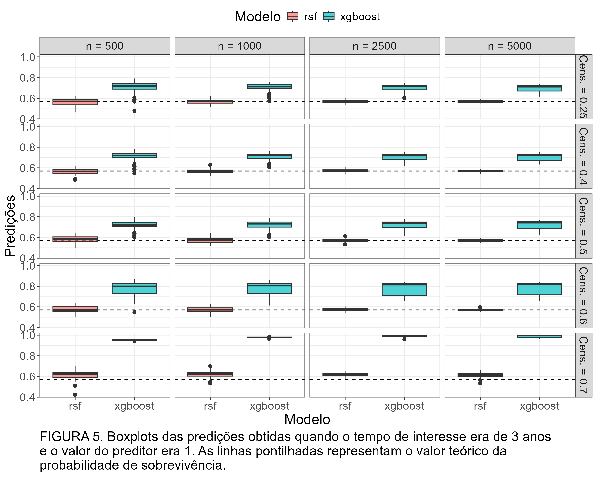
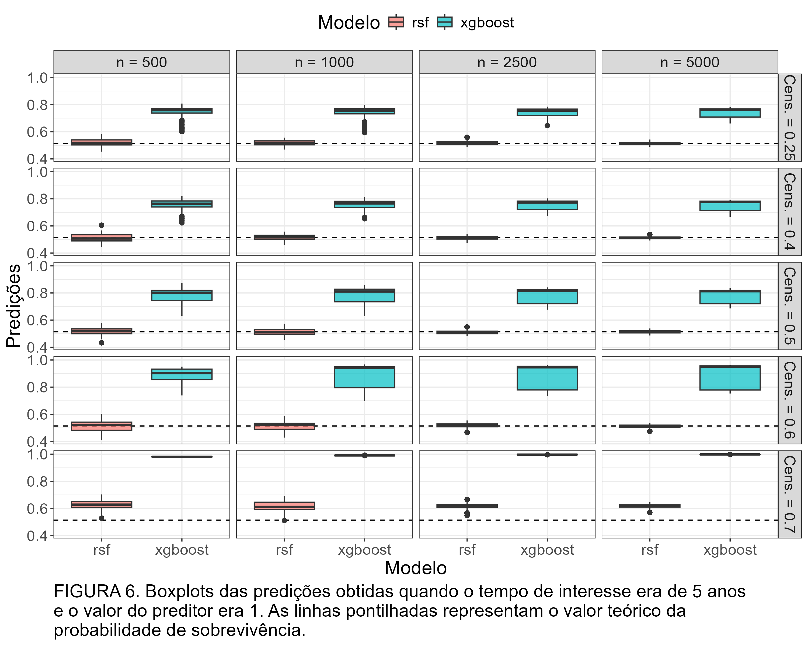

```{r setup, include=FALSE}
knitr::opts_chunk$set(echo = TRUE)
```

## Introdução

Este relatório tem como objetivo prover os resultados iniciais do estudo de simulação realizado para o artigo, o qual tem como objetivo avaliar o impacto da porcentagem de observações censuradas nas predições feitas pelo XGBoost e pelas Random Survival Forests.

## Metodologia

### Geração dos tempos de sobrevivência latentes

Foram gerados tempos de sobrevivência de dois grupos distintos, simulando o comportamento das curvas de sobrevivência estimadas via Kaplan-Meier para pacientes do conjunto de dados original que realizaram e não realizaram quimioterapia. Os dados de ambos os grupos foram simulados a partir de distribuições Weibull, cujos parâmetros são descritos abaixo:

- **Para as observações com preditor 0,** foram gerados dados da distribuição Weibull com parâmetros `shape = 0.2581641` e `scale = 68.4235846`;
- **Para as observações com preditor 1,** foram gerados dados da distribuição Weibull com parâmetros `shape = 0.333643` e `scale = 16.918016` .

Para a obtenção desses parâmetros, foram obtidas as probabilidade de sobrevivência estimadas nos tempos 5 e 10 para cada grupo de pacientes, as quais foram tratadas como probabilidades teóricas e foram plugadas nas expressões fechadas de cada parâmetro, obtidas a partir da função de sobrevivência da distribuição Weibull. 

### Geração dos tempos de censura

Para a obtenção dos tempos de censura, foram geradas observações de distribuições uniforme no intervalo $[0, \theta_i]$, $i = 0, 1$, sendo $\theta_i$ o valor de $\theta$ que resolvesse a equação $p_c = P(T_i > C_i)$, onde $p_c$ é a probabilidade de censura, $T_i$ é o tempo de sobrevivência latente, que segue a distribuição Weibull cujos parâmetros são especificados acima, e $C_i$ é o tempo de censura, que segue distribuição uniforme no intervalo $[0, \theta_i]$.

### Sobre as amostras e o ajuste dos modelos

Em todas as amostras simuladas, 70% das observações foram geradas com preditor 1 e 30% com preditor 0 (mantendo as proporções observadas para a variável de quimioterapia no conjunto de dados original).

Durante as simulações, após a divisão entre conjuntos de treino e teste, foram criados novos conjuntos de treino e teste específicos para o XGBoost, retirando as observações censuradas que tivessem tempo observado menor que o tempo de interesse daquela simulação.

Ademais, os mesmos hiperparãmetros do XGBoost tunados no artigo original foram também tunados, aqui, para cada combinação de probabilidade de censura e tempo de interesse. 

### Cenários considerados no estudo

Foram considerados os seguintes cenários:

- **Probabilidades de censura:** 0.25, 0.4, 0.5, 0.6 e 0.7.
- **Tempos de interesse:** 1, 3 e 5 anos.
- **Tamanhos de amostra:** 500, 1000, 2500 e 5000.

Para cada combinação de parâmetros, foram realizadas (apenas) 50 simulações. Ao final das 50 simulações, foram calculados o vício médio e o EQM das predições de cada modelo no conjunto de teste.

Todos os scripts utilizados e saídas resultantes podem ser vistos [neste link do GitHub](https://github.com/RafaHerzog/simulacao_artigo_sobrevivencia).

## Resultados preliminares do estudo

As figuras abaixo ilustram os resultados obtidos para os dois grupos de observações nos diferentes cenários simulados:

## {.tabset}

### Para as observações do grupo com preditor 0

```{r figuras0, echo=FALSE, fig.width=7, fig.height=5, out.width='100%'}



```


### Para as observações do grupo com preditor 1

```{r figuras1, echo=FALSE, fig.width=7, fig.height=5, out.width='100%'}



```
